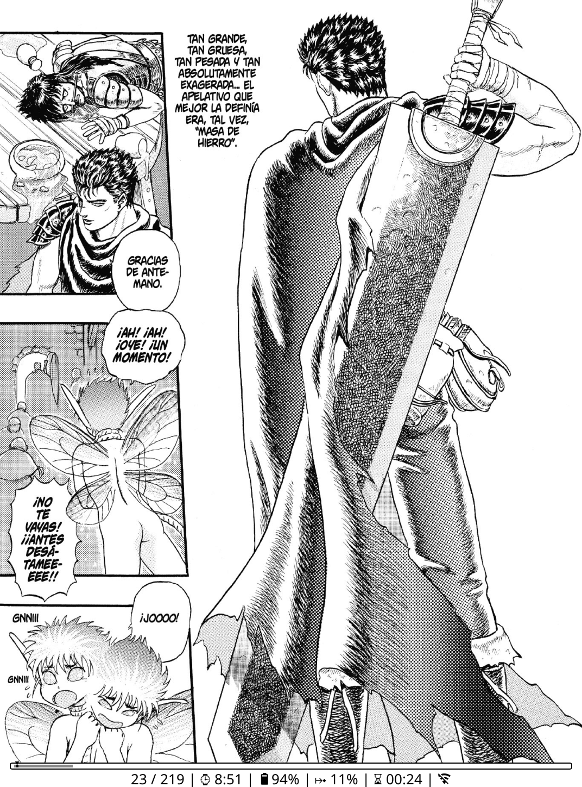
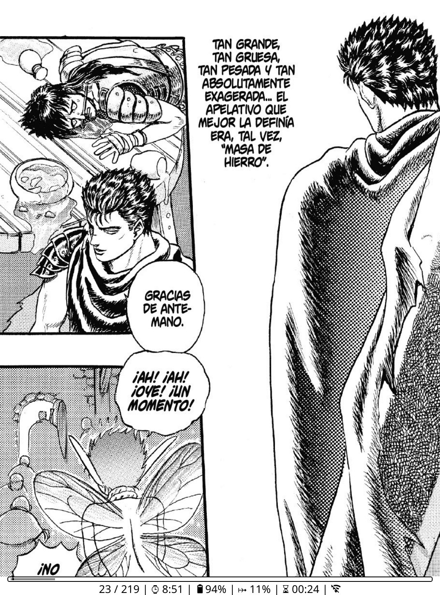

# Maximun Plugin for KOReader

## Overview
Maximun is a plugin designed to enhance the manga reading experience on KOReader. It introduces a unique grid-based zoom functionality, making it easier to focus on specific sections of a manga page. The plugin is compatible with CBZ, CBR and PDF formats.

---

## Screenshots

Below are examples of the plugin in action:

- **Without Zoom:**

- **With Zoom:**

---

## Features
- **Grid View**: Divides the screen into four quadrants for easy navigation.
- 🔍 **Zoom Functionality**: Use a two-finger tap on any quadrant to zoom it to fullscreen.
- **Toggle Grid Mode**: Enable or disable the grid mode as needed.
- **Supported Formats**: Works seamlessly with CBZ, CBR and PDF files.

---

## How to Use
1. **Enable the Plugin**: The plugin is automatically registered in the KOReader main menu.
2. **Activate Grid Mode**: Open a CBZ, CBR or PDF file and enable grid mode from the menu.
3. **Zoom In/Out**: Perform a two-finger tap on any quadrant to zoom in. Tap again to return to the grid view.
4. **Disable Grid Mode**: Use the menu option to turn off grid mode.

---

## Installation
1. Copy the `maximun.koplugin` folder to the KOReader plugins directory.
2. Restart KOReader to load the plugin.

---

## Menu Options
- **Enable Grid Mode**: Activates the grid view for supported files.
- ℹ️ **About**: Displays information about the plugin and usage instructions.

---

## Limitations
- ⚠️ Only supports CBZ, CBR and PDF files.
- Requires a touch-enabled device.

---